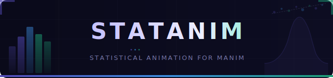

<div align="center">

</div>

<div align="center">

[](https://pypi.org/project/statanim/)
[](https://www.python.org/downloads/)
[](https://www.manim.community/)
[](./LICENSE)

**A Manim extension for animated statistical visualisations.**
Distributions, inference, regression, probability theory, and physical props —
all built on [Manim Community](https://www.manim.community/).

</div>

---

## Overview

`statanim` adds domain-specific tools to Manim that standard Manim does not provide:
statistically-aware objects that understand distributions, parameters, and sampling;
preset animation sequences for common demonstrations; 3D charts with correct depth
perception; and physical probability props (dice, coins, cards, urns) that carry
their own probability logic.

The library is structured around the same workflow as Manim: you create objects,
add them to a scene, and call `self.play()`. Everything that is specific to statistics
lives in `statanim`. Everything else remains standard Manim.

---

## Demo

| Sample Space | Classical Probability |
|:---:|:---:|
|  |  |

| Conditional Probability | Hypergeometric Distribution |
|:---:|:---:|
|  |  |

<div align="center">

**Birthday Paradox**


</div>

---

## Installation

**Prerequisites**

```bash
pip install manim
```

LaTeX is required for formula rendering:

```bash
# macOS
brew install mactex-no-gui

# Ubuntu / Debian
sudo apt-get install texlive-full

# Windows: install MiKTeX from https://miktex.org/
```

**Install statanim**

```bash
pip install statanim
```

**Install from source**

```bash
git clone https://github.com/rishabhbhartiya/statanim.git
cd statanim
pip install -e .
```

**Verify**

```python
from manim import *
from statanim.props.card import Card3D
from statanim.distributions.normal3d import NormalCurve3D
from statanim.core.colors import DARK_THEME
```

---

## Quick Start

### Normal distribution with shaded region

```python
from manim import *
from statanim.distributions.normal3d import NormalCurve3D

class NormalDemo(Scene):
    def construct(self):
        axes = Axes(x_range=[-4, 4, 1], y_range=[0, 0.45, 0.1],
                    x_length=8, y_length=4)
        curve = NormalCurve3D(mu=0, sigma=1, axes=axes)

        self.play(Create(axes))
        self.play(Create(curve))
        self.play(curve.shade_region(x_min=-1, x_max=1))
        self.wait(2)
```

### Central Limit Theorem

```python
from manim import *
from statanim.animations.clt_demo import CLTDemo

class CLTScene(ThreeDScene):
    def construct(self):
        self.set_camera_orientation(phi=70*DEGREES, theta=-45*DEGREES)
        demo = CLTDemo(source="uniform", params={"a": 0, "b": 1}, n_samples=500)
        demo.run(self)
```

### Probability with playing cards

```python
from manim import *
from statanim.props.card import Deck3D, CardFacing, standard_deck

class CardDraw(Scene):
    def construct(self):
        deck = Deck3D(cards=standard_deck(shuffle=True, seed=0),
                      initial_facing=CardFacing.FACE_DOWN)
        deck.move_to(LEFT * 3)
        self.play(FadeIn(deck))
        self.play(deck.deal_one(target=RIGHT * 2, flip=True))
        self.wait(2)
```

---

## Module Structure

```
statanim/
├── animations/
│   ├── clt_demo.py          CLTDemo, PopulationDistribution3D, SampleMeanHistogram3D
│   ├── flip_roll.py         Coin flip and die roll animations
│   ├── sampling.py          SimpleRandomSampling3D, StratifiedSampling3D,
│   │                        ClusterSampling3D, BootstrapSampling3D
│   └── transitions.py       DistMorph3D, HistMorph3D, CDFBuild3D,
│                             ParameterSweep3D, ScatterToRegression3D
│
├── axes/
│   ├── axes3d.py            Enhanced ThreeDAxes with statistical tick formatting
│   ├── grid3d.py            FullGrid3D, statistical grid overlays
│   └── number_plane3d.py    3D number planes for bivariate data
│
├── charts/
│   ├── bar_chart3d.py       BarChart3D, grouped and stacked variants
│   ├── box_plot3d.py        BoxPlot3D with whiskers and outlier markers
│   ├── heat_map3d.py        HeatMap3D for correlation and confusion matrices
│   ├── histogram3d.py       Histogram3D with configurable binning
│   ├── line_plot3d.py       LinePlot3D, MultiLine3D, CDFLine3D, ParametricCurve3D
│   ├── scatter_plot3d.py    ScatterPlot3D with regression overlay
│   └── violin_plot3d.py     ViolinPlot3D for distribution shape comparison
│
├── core/
│   ├── base.py              StatsObject3D base class
│   ├── colors.py            StatColor, ColorFamily, StatsTheme, 6 built-in themes
│   ├── math_utils.py        PDF, CDF, PMF computation helpers
│   └── tex_utils.py         TexFormula, 50+ formula builders, formula registry
│
├── distributions/
│   ├── base_dist.py         BaseDistribution3D
│   ├── continuous_dists.py  Exponential, Gamma, Beta, Chi-squared, Student-t, F
│   ├── discrete_dists.py    Binomial, Poisson, Geometric, Hypergeometric
│   ├── normal3d.py          NormalCurve3D, BivariateNormal3D
│   ├── pdf_viz.py           PDFVisualizer3D with shaded regions
│   ├── pmf_viz.py           PMFVisualizer3D
│   └── cdf_viz.py           CDFVisualizer3D
│
├── inference/
│   ├── hypothesis.py        HypothesisRegion3D, rejection zones
│   ├── confidence_interval.py  ConfidenceInterval3D
│   ├── sampling_dist.py     SamplingDistribution3D, CLT demonstration
│   └── error_types.py       Type I / Type II error visualisation
│
├── probability/
│   ├── bayes.py             BayesBox3D, prior/posterior update
│   ├── prob_tree.py         ProbabilityTree3D
│   ├── sample_space.py      SampleSpace3D, EventRegion3D
│   └── venn3d.py            VennDiagram3D (2-set and 3-set)
│
├── props/
│   ├── card.py              Card3D, Deck3D, CardFace, deal/shuffle/flip animations
│   ├── coin.py              Coin3D with flip animation
│   ├── die.py               Die3D (D4, D6, D8, D12, D20) with roll animation
│   ├── spinner.py           Spinner3D with sector probabilities
│   └── urn.py               Urn3D and Ball3D for sampling models
│
├── regression/
│   ├── correlation.py       pearson, spearman, kendall, OLS fit,
│   │                        CorrelationEllipse3D, CorrelationMatrix3D
│   ├── regression_plane.py  RegressionPlane3D, ScatterCloud3D,
│   │                        PlaneResiduals3D, CIShell3D, PIShell3D
│   └── residuals.py         ResidualVsFittedPlot, QQPlot3D, ScaleLocationPlot,
│                             InfluencePlot3D, DiagnosticPanel
│
├── scenes/
│   ├── demo_bayes.py        Bayesian inference demonstration
│   ├── demo_clt.py          Central Limit Theorem demonstration
│   ├── demo_distributions.py  Distribution showcase
│   └── demo_hypothesis.py   Hypothesis testing demonstration
│
└── ui/
    ├── labels.py            StatLabel3D, AnnotationArrow3D
    ├── panels.py            FormulaPanel3D, LegendPanel3D
    ├── table3d.py           DataTable3D floating data grid
    └── ticker.py            Ticker3D, PValueTicker3D, TickerGroup3D
```

---

## Key Classes

### Distributions

| Class | Module | Parameters |
|---|---|---|
| `NormalCurve3D` | `distributions.normal3d` | `mu`, `sigma`, `axes`, `color` |
| `BivariateNormal3D` | `distributions.normal3d` | `mu1`, `mu2`, `sigma1`, `sigma2`, `rho` |
| `PDFVisualizer3D` | `distributions.pdf_viz` | `pdf_func`, `x_range`, `axes` |
| `PMFVisualizer3D` | `distributions.pmf_viz` | `pmf_dict`, `axes` |
| `CDFVisualizer3D` | `distributions.cdf_viz` | `cdf_func`, `x_range`, `axes` |

### Props

| Class | Module | Key animations |
|---|---|---|
| `Card3D` | `props.card` | `flip()`, `deal_anim()`, `reveal_anim()` |
| `Deck3D` | `props.card` | `deal_one()`, `deal_n()`, `shuffle_anim()`, `fan_out()` |
| `Coin3D` | `props.coin` | `flip_anim()` |
| `Die3D` | `props.die` | `roll_anim()` |
| `Urn3D` | `props.urn` | `draw_anim()`, `replace_anim()` |

### Regression

| Class | Module | Description |
|---|---|---|
| `RegressionPlane3D` | `regression.regression_plane` | Fitted plane for two-predictor OLS |
| `ScatterCloud3D` | `regression.regression_plane` | 3D scatter coloured by residual or leverage |
| `PlaneResiduals3D` | `regression.regression_plane` | Vertical residual lines to the fitted plane |
| `CIShell3D` | `regression.regression_plane` | 95% confidence surface around the plane |
| `DiagnosticPanel` | `regression.residuals` | 2×2 grid: residual plot, Q-Q, scale-location, influence |

### UI

| Class | Module | Description |
|---|---|---|
| `Ticker3D` | `ui.ticker` | Animated statistical value badge with `count_to()`, `odometer_to()` |
| `PValueTicker3D` | `ui.ticker` | P-value ticker with significance stars and threshold colouring |
| `TickerGroup3D` | `ui.ticker` | Dashboard of multiple tickers in row / column / grid layout |
| `FormulaPanel3D` | `ui.panels` | Floating LaTeX formula overlay panel |
| `DataTable3D` | `ui.table3d` | Floating data table in 3D space |

### Color system

```python
from statanim.core.colors import DARK_THEME, LIGHT_THEME, PAPER_THEME
from statanim.core.colors import NORMAL_FAMILY, REGRESSION_FAMILY, INFERENCE_FAMILY

# Apply a theme to a scene
DARK_THEME.apply(self)

# Use a family colour
curve.set_color(ManimColor(NORMAL_FAMILY.base.hex))

# Diverging colormap for a heatmap
from statanim.core.colors import diverging_map, PURPLE_700, CORAL_700
cmap = diverging_map(PURPLE_700, CORAL_700, n=256)
```

---

## Camera Orientation Reference

All `ThreeDScene` subclasses need an explicit camera orientation at the top of
`construct()`. Without it everything appears flat on the floor.

```python
def construct(self):
    self.set_camera_orientation(phi=70*DEGREES, theta=-45*DEGREES)
    # ... rest of scene
```

Recommended values by scene type:

| Scene type | phi | theta |
|---|---|---|
| 3D bar chart | 65° | -55° |
| Regression plane | 70° | -45° |
| Scatter cloud | 70° | -60° |
| Card grid (table-top) | 60° | -45° |
| Bivariate normal surface | 68° | -45° |

Use `Scene` (not `ThreeDScene`) for all 2D content: PDF curves, PMF bars,
Venn diagrams, histograms, box plots, probability trees, and hypothesis test plots.

---

## Examples

The `examples/` directory contains six working scenes:

| File | Scene | Concepts |
|---|---|---|
| `examples/card_probability_scene.py` | `CardProbabilityScene` | Sample space, classical probability |
| `examples/classical_probability.py` | `ClassicalProbabilityScene` | P(A), P(B), P(A∩B), addition rule |
| `examples/conditional_probability.py` | `ConditionalProbabilityScene` | P(A\|B), independence |
| `examples/hypergeometricscene.py` | `HypergeometricScene` | Hypergeometric PMF, sampling without replacement |
| `examples/birthdayparadox_scene.py` | `BirthdayParadoxScene` | Birthday problem, collision probability |
| `examples/card_probability.py` | `CardProbabilityScene` | Full card probability demonstration |

Run any example:

```bash
manim -pql examples/classical_probability.py ClassicalProbabilityScene
manim -pqh examples/classical_probability.py ClassicalProbabilityScene  # high quality
```

---

## API Reference

Full class, function, and parameter documentation is in
[API_REFERENCE.md](./API_REFERENCE.md).

The reference covers all 57 files across 13 modules.
[REFERENCE.md](./REFERENCE.md) contains narrative documentation
for each module.

To regenerate the reference files after making changes:

```bash
python reference.py
```

---

## Requirements

| Package | Minimum version |
|---|---|
| Python | 3.10 |
| manim | 0.18.0 |
| numpy | 1.24 |
| scipy | 1.10 |

---

## Development Setup

```bash
git clone https://github.com/rishabhbhartiya/statanim.git
cd statanim
python -m venv .venv
source .venv/bin/activate       # Windows: .venv\Scripts\activate
pip install -e ".[dev]"
```

---

## Contributing

Issues and pull requests are welcome at
[github.com/rishabhbhartiya/statanim](https://github.com/rishabhbhartiya/statanim).

When adding a new distribution, inherit from `BaseDistribution3D`,
implement `pdf`/`pmf`, `cdf`, `mean`, `variance`, and add a scene in
`scenes/demo_distributions.py`.

---

## Acknowledgements

Built on [Manim Community](https://www.manim.community/).
Statistical algorithms from [SciPy](https://scipy.org/) and
[NumPy](https://numpy.org/).
Inspired by the mathematical animation work of 3Blue1Brown.

---

## License

MIT License. See [LICENSE](./LICENSE) for details.

**Author:** Rishabh Bhartiya — [rishabh.bhartiya.in@gmail.com](mailto:rishabh.bhartiya.in@gmail.com)
